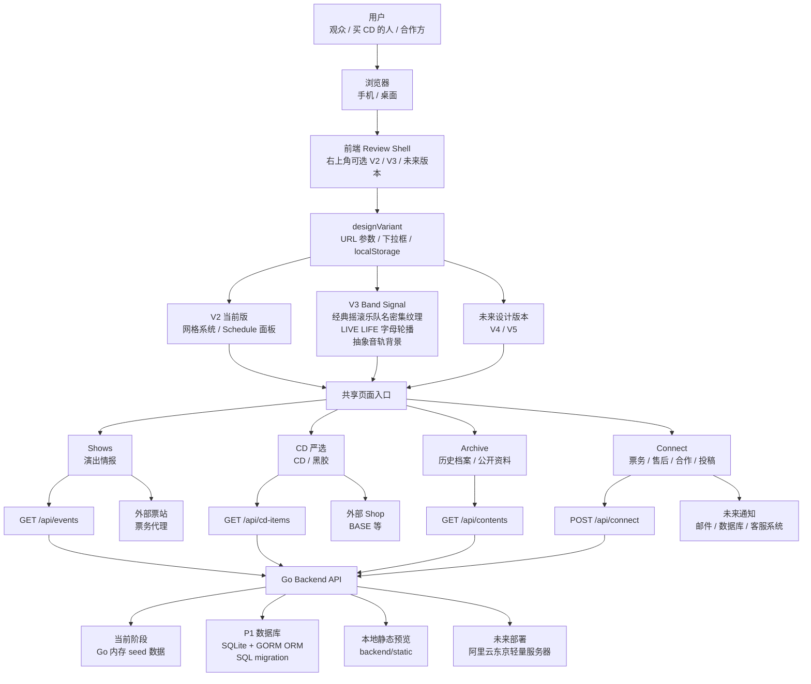
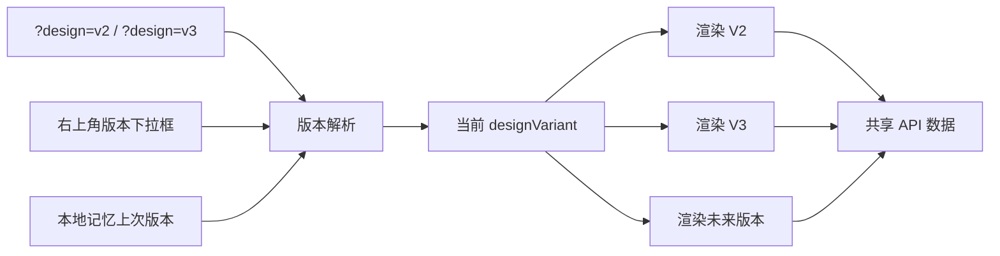
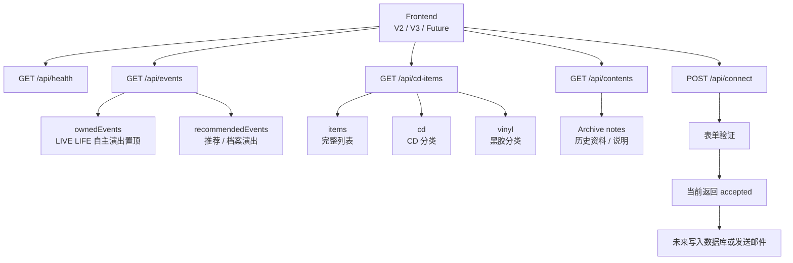
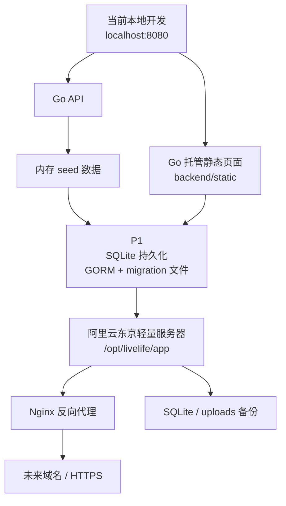
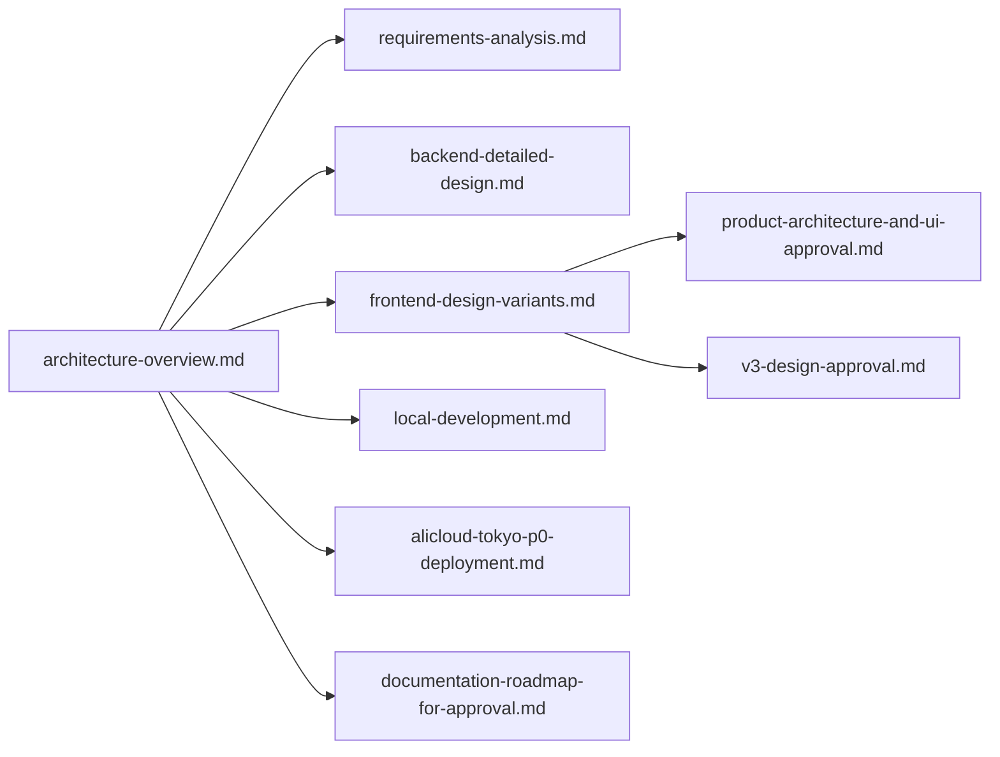

# LIVE LIFE 整体架构图

状态：当前开发基准  
最后更新：2026-06-08

这个文档用于从最高层说明 LIVE LIFE 的整体结构。  
设计版本以后会继续变化，但产品入口、API 逻辑和未来部署方向先保持稳定。

## 1. 总体架构



## 2. 架构原则

### 2.1 设计版本和业务逻辑分离

V2、V3、未来 V4/V5 只是前端视觉 Renderer。

它们共享：

- 同一套页面入口。
- 同一套语言策略。
- 同一套 API。
- 同一套购买路径。
- 同一套 Connect 表单逻辑。

这样客户 Review 时可以自由切换设计，但不会影响后端数据结构。

### 2.2 顶层没有 Shop

当前顶层入口固定为：

```text
Shows / CD 严选 / Archive / Connect
```

购买路径放在 CD/黑胶单品卡片里：

```text
CD 严选 -> 单品卡片 -> 点击此处购买 -> 外部 Shop
```

演出票务也可以跳外部票站。

### 2.3 Connect 是统一问题入口

Connect 承接：

- 票务问题。
- 外部购买后未收到货。
- CD/黑胶购买咨询。
- 发货问题。
- 合作。
- 投稿。

未来如果做站内支付或订单系统，再从 Connect 扩展到完整售后流程。

### 2.4 数据库选型原则

当前 P1 选择：

```text
SQLite + GORM + SQL migration
```

原因：

- 当前数据主要是演出、CD/黑胶、Archive、Connect 消息，读多写少。
- 购买和票务都先跳外部平台，不需要站内订单和库存锁定。
- 阿里云轻量服务器上，SQLite 单文件更容易备份和迁移。
- Go 后端可以通过 GORM 快速接入表结构，同时保留未来迁移 PostgreSQL 的可能。

未来升级 PostgreSQL 的触发条件：

- 做站内支付、订单、库存。
- 多人后台频繁同时编辑。
- 多实例部署。
- 复杂报表或全文搜索。
- SQLite 写入锁或备份策略无法满足运营。

## 3. 前端版本切换图



## 4. 后端 API 图



## 5. 部署演进图



## 6. 当前文档关系


