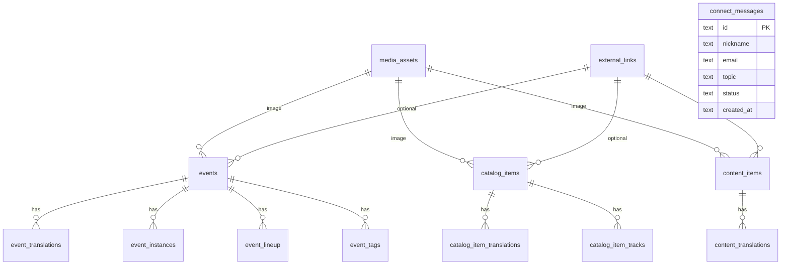

# LIVE LIFE 数据库选型与表设计

状态：当前数据库设计草案  
最后更新：2026-06-08

这个文档根据当前 LIVE LIFE 需求整理数据库选型、后端 ORM 方案和第一版表结构。  
设计页面可以继续有 V2、V3、V4，但数据库和 API 逻辑先保持稳定。

## 1. 结论

当前建议：

```text
P1 数据库：SQLite
Go ORM：GORM
SQLite Driver：优先 github.com/glebarez/sqlite
Migration：SQL migration 文件，建议 goose
未来升级：需要多人后台、高并发写入、复杂订单时再迁移 PostgreSQL
```

一句话原因：

```text
LIVE LIFE 当前是内容型音乐入口 + 外部购买链接，不是高并发交易系统；SQLite 最简单、最便宜、最好备份，GORM 能快速把 Go 结构和数据库表接起来。
```

## 2. 数据库选型

### 2.1 为什么 P1 选 SQLite

LIVE LIFE 当前需求：

- 展示演出情报。
- 展示 CD/黑胶严选。
- 展示 Archive。
- 保存 Connect 表单消息。
- 购买和票务先跳外部平台。
- 暂时不做站内支付、订单、库存锁定。

这些需求数据量小、写入频率低、读多写少，非常适合 SQLite。

SQLite 的优点：

- 单文件数据库，备份和迁移很直观。
- 不需要单独数据库服务，服务器配置更简单。
- 适合阿里云轻量应用服务器这种小型部署。
- 本地开发和服务器部署可以用同一套文件结构。
- 未来如果要迁移 PostgreSQL，表结构本身仍然是关系型设计，可以迁移。

部署路径建议：

```text
/opt/livelife/data/sqlite/livelife.db
```

本地路径建议：

```text
backend/data/livelife.dev.db
```

### 2.2 什么时候升级 PostgreSQL

出现下面情况时，再考虑 PostgreSQL：

- 做站内登录注册、订单、支付、库存。
- 多个后台人员频繁同时编辑内容。
- 需要复杂查询、报表、全文搜索。
- 需要多个应用实例同时写入。
- SQLite 备份、锁等待或写入冲突开始影响运营。

当前不建议一开始上 PostgreSQL，原因是会增加服务器维护、备份、权限和部署复杂度。

## 3. ORM 选型

### 3.1 推荐 GORM

Go 后端当前建议使用 GORM。

原因：

- 当前项目数据结构清楚，主要是 CRUD 和关联查询。
- GORM 对 Go 新项目上手快。
- GORM 支持 SQLite、PostgreSQL 等数据库，后续迁移方向不被锁死。
- GORM 能处理关联、事务、预加载、基础查询和模型映射。

### 3.2 SQLite Driver 推荐

优先推荐：

```go
github.com/glebarez/sqlite
gorm.io/gorm
```

原因：

- `glebarez/sqlite` 是 GORM 的纯 Go SQLite driver。
- 不依赖 CGO，不要求本地或 Docker 镜像里有 gcc。
- 对 Windows 本地开发和轻量服务器部署更省心。

备选：

```go
gorm.io/driver/sqlite
gorm.io/gorm
```

说明：

- 这是 GORM 官方常见 SQLite driver。
- 但它基于 `mattn/go-sqlite3`，通常需要 CGO 和 gcc。
- 如果后续 Docker 基础镜像和服务器编译环境都稳定，可以再换。

### 3.3 Migration 建议

不建议生产环境完全依赖 `AutoMigrate`。

建议策略：

- 本地早期原型可以用 GORM `AutoMigrate` 快速试表。
- 一旦确定表结构，就写 SQL migration 文件。
- 生产环境只跑 migration 文件。

推荐工具：

```text
goose
```

建议目录：

```text
backend/migrations/
```

示例：

```text
backend/migrations/0001_init.sql
backend/migrations/0002_add_content_body.sql
```

## 4. 后端代码分层建议

当前 Go 代码还在一个 `main.go` 里，后续接数据库时建议分层：

```text
backend/
  cmd/server/main.go
  internal/config/
  internal/db/
    connect.go
    models/
  internal/repository/
    events.go
    catalog.go
    contents.go
    connect_messages.go
  internal/httpapi/
    handlers.go
  migrations/
```

原则：

- GORM model 不直接等于 API response。
- API response 继续保留现在的 DTO 结构，例如 `Event`、`CatalogItem`。
- Repository 负责把数据库模型组装成 API DTO。
- Handler 不直接写复杂 SQL。
- 创建演出、CD 单品这类多表写入时必须使用事务。

## 5. 命名规则

### 5.1 ID

对外可见的主 ID 建议使用可读 slug：

```text
redhair-2026-july
redhair-demo-cd
about-live-life
```

Connect 表单消息建议使用不可猜的 ID：

```text
conn_01J...
```

也可以先用 SQLite 自增整数，但如果以后要在后台或邮件里暴露消息 ID，文本 ID 更安全。

### 5.2 时间

SQLite 中建议用 `TEXT` 存 ISO/RFC3339 时间：

```text
2026-06-08T10:00:00+09:00
```

原因：

- SQLite 没有严格 datetime 类型。
- 文本时间易读、易备份、跨语言处理简单。

### 5.3 布尔值

SQLite 中布尔值使用 `INTEGER`：

```text
0 = false
1 = true
```

## 6. 表结构总览



## 7. 表设计详情

### 7.1 media_assets

用途：

- 统一管理首页图、演出图、CD/黑胶封面、Archive 图片。

字段：

| 字段 | 类型 | 说明 |
| --- | --- | --- |
| id | TEXT PK | 图片 ID，例如 `asset_redhair_2026_july` |
| kind | TEXT | `event_poster`、`catalog_cover`、`archive_image`、`hero_image` |
| storage_path | TEXT | 本地或服务器路径，例如 `/assets/events/redhair.jpg` |
| source_url | TEXT | 原始来源链接，可为空 |
| original_filename | TEXT | 原始文件名 |
| mime_type | TEXT | `image/jpeg`、`image/png` |
| width | INTEGER | 图片宽度 |
| height | INTEGER | 图片高度 |
| alt_text | TEXT | 默认替代文本 |
| credit | TEXT | 摄影、设计或来源备注 |
| usage_scope | TEXT | `public`、`internal_reference` |
| created_at | TEXT | 创建时间 |
| updated_at | TEXT | 更新时间 |

### 7.2 events

用途：

- 表示一个演出项目或演出系列。
- LIVE LIFE 自主演出和推荐演出都在这里。

字段：

| 字段 | 类型 | 说明 |
| --- | --- | --- |
| id | TEXT PK | 演出 ID |
| brand | TEXT | 固定 `LIVE LIFE` |
| owned | INTEGER | 是否 LIVE LIFE 自主演出 |
| category | TEXT | `own-live`、`recommended-live`、`archive-live` |
| status | TEXT | `draft`、`published`、`archived` |
| title_fallback | TEXT | 默认标题 |
| summary_fallback | TEXT | 默认摘要 |
| ticket_note_fallback | TEXT | 默认票务说明 |
| source_note_fallback | TEXT | 默认资料备注 |
| image_asset_id | TEXT FK | 主图 |
| display_order | INTEGER | 排序 |
| published_at | TEXT | 发布时间 |
| created_at | TEXT | 创建时间 |
| updated_at | TEXT | 更新时间 |
| deleted_at | TEXT | 软删除 |

说明：

- `owned = 1` 的演出在前端 Shows 区域置顶。
- 7月10日和7月14日这种双日演出，可以用一个 `events` 记录，再用 `event_instances` 拆日期和场地。

### 7.3 event_translations

用途：

- 保存演出三语言文案。

字段：

| 字段 | 类型 | 说明 |
| --- | --- | --- |
| event_id | TEXT FK | 关联 events |
| lang | TEXT | `zh`、`ja`、`en` |
| title | TEXT | 标题 |
| summary | TEXT | 摘要 |
| ticket_note | TEXT | 票务说明 |
| source_note | TEXT | 资料备注 |

主键：

```text
event_id + lang
```

### 7.4 event_instances

用途：

- 表示一次具体场次。
- 适合 7月10日、7月14日这种同一项目多场演出。

字段：

| 字段 | 类型 | 说明 |
| --- | --- | --- |
| id | TEXT PK | 场次 ID |
| event_id | TEXT FK | 关联 events |
| date | TEXT | 日期，例如 `2026-07-10` |
| open_time | TEXT | 开场时间，例如 `18:45` |
| start_time | TEXT | 开演时间，例如 `19:30` |
| venue_name | TEXT | 场地 |
| area | TEXT | 区域，例如 `Shibuya` |
| price_label | TEXT | 价格展示，例如 `adv. 5000円 + 1D` |
| ticket_url | TEXT | 外部票站链接 |
| ticket_platform | TEXT | 票务平台 |
| map_url | TEXT | 地图链接 |
| display_order | INTEGER | 排序 |
| created_at | TEXT | 创建时间 |
| updated_at | TEXT | 更新时间 |

### 7.5 event_lineup

用途：

- 保存演出阵容。

字段：

| 字段 | 类型 | 说明 |
| --- | --- | --- |
| id | INTEGER PK | 自增 ID |
| event_id | TEXT FK | 关联 events |
| instance_id | TEXT FK | 可为空；如果阵容按场次不同，就填 |
| name | TEXT | 艺人/乐队名 |
| role | TEXT | `main`、`guest`、`dj` 等 |
| display_order | INTEGER | 排序 |

### 7.6 event_tags

用途：

- 保存演出标签。

字段：

| 字段 | 类型 | 说明 |
| --- | --- | --- |
| event_id | TEXT FK | 关联 events |
| tag | TEXT | 标签 |

主键：

```text
event_id + tag
```

### 7.7 catalog_items

用途：

- 保存 CD 严选单品。
- CD 和黑胶都在同一张表，用 `format` 区分。

字段：

| 字段 | 类型 | 说明 |
| --- | --- | --- |
| id | TEXT PK | 单品 ID |
| brand | TEXT | 固定 `LIVE LIFE` |
| format | TEXT | `cd`、`vinyl` |
| artist | TEXT | 艺人/乐队名 |
| title_fallback | TEXT | 默认标题 |
| summary_fallback | TEXT | 默认摘要 |
| status | TEXT | `draft`、`curating`、`external_shop`、`sold_out` |
| price_label | TEXT | 展示价格，例如 `TBD`、`2500円` |
| price_amount | INTEGER | 价格数字，日元可直接存整数，可为空 |
| currency | TEXT | 默认 `JPY` |
| image_asset_id | TEXT FK | 封面图 |
| display_order | INTEGER | 排序 |
| published_at | TEXT | 发布时间 |
| created_at | TEXT | 创建时间 |
| updated_at | TEXT | 更新时间 |
| deleted_at | TEXT | 软删除 |

约束：

```text
format in ('cd', 'vinyl')
```

### 7.8 catalog_item_translations

用途：

- 保存 CD/黑胶单品三语言文案。

字段：

| 字段 | 类型 | 说明 |
| --- | --- | --- |
| item_id | TEXT FK | 关联 catalog_items |
| lang | TEXT | `zh`、`ja`、`en` |
| title | TEXT | 标题 |
| summary | TEXT | 推荐语/介绍 |
| purchase_text | TEXT | 购买按钮文案 |

主键：

```text
item_id + lang
```

### 7.9 catalog_item_tracks

用途：

- 保存 CD/黑胶曲目或说明条目。
- 当前可先用占位 tracks，后续真实 CD 信息来了再补。

字段：

| 字段 | 类型 | 说明 |
| --- | --- | --- |
| id | INTEGER PK | 自增 ID |
| item_id | TEXT FK | 关联 catalog_items |
| side_label | TEXT | `A`、`B`、`CD`，可为空 |
| position | INTEGER | 曲序 |
| title | TEXT | 曲名或说明 |
| duration_label | TEXT | 时长，可为空 |

### 7.10 content_items

用途：

- 保存 Archive 内容。
- 可以是说明文章、历史海报、公开资料备注等。

字段：

| 字段 | 类型 | 说明 |
| --- | --- | --- |
| id | TEXT PK | 内容 ID |
| brand | TEXT | 固定 `LIVE LIFE` |
| type | TEXT | `note`、`poster`、`article`、`photo` |
| title_fallback | TEXT | 默认标题 |
| summary_fallback | TEXT | 默认摘要 |
| body_fallback | TEXT | 默认正文，可为空 |
| image_asset_id | TEXT FK | 主图 |
| source_url | TEXT | 外部来源 |
| display_order | INTEGER | 排序 |
| published_at | TEXT | 发布时间 |
| created_at | TEXT | 创建时间 |
| updated_at | TEXT | 更新时间 |
| deleted_at | TEXT | 软删除 |

### 7.11 content_translations

用途：

- 保存 Archive 三语言内容。

字段：

| 字段 | 类型 | 说明 |
| --- | --- | --- |
| content_id | TEXT FK | 关联 content_items |
| lang | TEXT | `zh`、`ja`、`en` |
| title | TEXT | 标题 |
| summary | TEXT | 摘要 |
| body | TEXT | 正文 |

主键：

```text
content_id + lang
```

### 7.12 external_links

用途：

- 统一保存 BASE、票站、Instagram、小红书、来源页等外部链接。
- 避免把外部平台误写成站内能力。

字段：

| 字段 | 类型 | 说明 |
| --- | --- | --- |
| id | INTEGER PK | 自增 ID |
| owner_type | TEXT | `event`、`event_instance`、`catalog_item`、`content_item` |
| owner_id | TEXT | 对应内容 ID |
| link_type | TEXT | `ticket`、`purchase`、`source`、`social`、`map` |
| platform | TEXT | `BASE`、`Instagram`、`Xiaohongshu`、`Ticket` 等 |
| url | TEXT | 外部链接 |
| label | TEXT | 默认按钮或链接文案 |
| display_order | INTEGER | 排序 |
| created_at | TEXT | 创建时间 |

说明：

- 当前 API 的 `purchaseUrl` 可以从这里取第一条 `owner_type = catalog_item` 且 `link_type = purchase` 的链接。
- 演出票务也可以从这里取 `link_type = ticket`。

### 7.13 connect_messages

用途：

- 保存 Connect 表单消息。

字段：

| 字段 | 类型 | 说明 |
| --- | --- | --- |
| id | TEXT PK | 消息 ID |
| nickname | TEXT | 昵称 |
| email | TEXT | 邮箱 |
| topic | TEXT | `ticket`、`cd-select`、`support`、`collab` |
| message | TEXT | 留言 |
| status | TEXT | `new`、`in_progress`、`resolved`、`spam` |
| user_locale | TEXT | 用户界面语言 |
| source_page | TEXT | 提交页面 |
| internal_note | TEXT | 内部处理备注 |
| created_at | TEXT | 创建时间 |
| handled_at | TEXT | 处理时间 |
| updated_at | TEXT | 更新时间 |

说明：

- 当前前端 topic 已有票务、CD 严选、购买/发货、合作/投稿。
- 后续接邮件时，仍然建议先写入数据库，再发邮件，避免邮件失败导致消息丢失。

### 7.14 site_settings

用途：

- 保存站点级配置。
- 当前不是必须，但可以给未来 Review 默认版本、上线版本、维护模式用。

字段：

| 字段 | 类型 | 说明 |
| --- | --- | --- |
| key | TEXT PK | 配置键 |
| value | TEXT | 配置值 |
| updated_at | TEXT | 更新时间 |

示例：

```text
default_design_variant = v2
public_design_variant = v3
review_mode_enabled = true
```

## 8. 第一版 SQL 草案

这不是现在立刻执行的 migration，而是 P1 接数据库时的初始依据。

```sql
PRAGMA foreign_keys = ON;

CREATE TABLE media_assets (
  id TEXT PRIMARY KEY,
  kind TEXT NOT NULL,
  storage_path TEXT NOT NULL,
  source_url TEXT,
  original_filename TEXT,
  mime_type TEXT,
  width INTEGER,
  height INTEGER,
  alt_text TEXT,
  credit TEXT,
  usage_scope TEXT NOT NULL DEFAULT 'public',
  created_at TEXT NOT NULL,
  updated_at TEXT NOT NULL
);

CREATE TABLE events (
  id TEXT PRIMARY KEY,
  brand TEXT NOT NULL DEFAULT 'LIVE LIFE',
  owned INTEGER NOT NULL DEFAULT 0,
  category TEXT NOT NULL,
  status TEXT NOT NULL DEFAULT 'draft',
  title_fallback TEXT NOT NULL,
  summary_fallback TEXT,
  ticket_note_fallback TEXT,
  source_note_fallback TEXT,
  image_asset_id TEXT,
  display_order INTEGER NOT NULL DEFAULT 0,
  published_at TEXT,
  created_at TEXT NOT NULL,
  updated_at TEXT NOT NULL,
  deleted_at TEXT,
  FOREIGN KEY (image_asset_id) REFERENCES media_assets(id)
);

CREATE TABLE event_translations (
  event_id TEXT NOT NULL,
  lang TEXT NOT NULL,
  title TEXT NOT NULL,
  summary TEXT,
  ticket_note TEXT,
  source_note TEXT,
  PRIMARY KEY (event_id, lang),
  FOREIGN KEY (event_id) REFERENCES events(id) ON DELETE CASCADE
);

CREATE TABLE event_instances (
  id TEXT PRIMARY KEY,
  event_id TEXT NOT NULL,
  date TEXT,
  open_time TEXT,
  start_time TEXT,
  venue_name TEXT,
  area TEXT,
  price_label TEXT,
  ticket_url TEXT,
  ticket_platform TEXT,
  map_url TEXT,
  display_order INTEGER NOT NULL DEFAULT 0,
  created_at TEXT NOT NULL,
  updated_at TEXT NOT NULL,
  FOREIGN KEY (event_id) REFERENCES events(id) ON DELETE CASCADE
);

CREATE TABLE event_lineup (
  id INTEGER PRIMARY KEY AUTOINCREMENT,
  event_id TEXT NOT NULL,
  instance_id TEXT,
  name TEXT NOT NULL,
  role TEXT,
  display_order INTEGER NOT NULL DEFAULT 0,
  FOREIGN KEY (event_id) REFERENCES events(id) ON DELETE CASCADE,
  FOREIGN KEY (instance_id) REFERENCES event_instances(id) ON DELETE CASCADE
);

CREATE TABLE event_tags (
  event_id TEXT NOT NULL,
  tag TEXT NOT NULL,
  PRIMARY KEY (event_id, tag),
  FOREIGN KEY (event_id) REFERENCES events(id) ON DELETE CASCADE
);

CREATE TABLE catalog_items (
  id TEXT PRIMARY KEY,
  brand TEXT NOT NULL DEFAULT 'LIVE LIFE',
  format TEXT NOT NULL,
  artist TEXT NOT NULL,
  title_fallback TEXT NOT NULL,
  summary_fallback TEXT,
  status TEXT NOT NULL DEFAULT 'draft',
  price_label TEXT,
  price_amount INTEGER,
  currency TEXT NOT NULL DEFAULT 'JPY',
  image_asset_id TEXT,
  display_order INTEGER NOT NULL DEFAULT 0,
  published_at TEXT,
  created_at TEXT NOT NULL,
  updated_at TEXT NOT NULL,
  deleted_at TEXT,
  CHECK (format IN ('cd', 'vinyl')),
  FOREIGN KEY (image_asset_id) REFERENCES media_assets(id)
);

CREATE TABLE catalog_item_translations (
  item_id TEXT NOT NULL,
  lang TEXT NOT NULL,
  title TEXT NOT NULL,
  summary TEXT,
  purchase_text TEXT,
  PRIMARY KEY (item_id, lang),
  FOREIGN KEY (item_id) REFERENCES catalog_items(id) ON DELETE CASCADE
);

CREATE TABLE catalog_item_tracks (
  id INTEGER PRIMARY KEY AUTOINCREMENT,
  item_id TEXT NOT NULL,
  side_label TEXT,
  position INTEGER NOT NULL DEFAULT 0,
  title TEXT NOT NULL,
  duration_label TEXT,
  FOREIGN KEY (item_id) REFERENCES catalog_items(id) ON DELETE CASCADE
);

CREATE TABLE content_items (
  id TEXT PRIMARY KEY,
  brand TEXT NOT NULL DEFAULT 'LIVE LIFE',
  type TEXT NOT NULL,
  title_fallback TEXT NOT NULL,
  summary_fallback TEXT,
  body_fallback TEXT,
  image_asset_id TEXT,
  source_url TEXT,
  display_order INTEGER NOT NULL DEFAULT 0,
  published_at TEXT,
  created_at TEXT NOT NULL,
  updated_at TEXT NOT NULL,
  deleted_at TEXT,
  FOREIGN KEY (image_asset_id) REFERENCES media_assets(id)
);

CREATE TABLE content_translations (
  content_id TEXT NOT NULL,
  lang TEXT NOT NULL,
  title TEXT NOT NULL,
  summary TEXT,
  body TEXT,
  PRIMARY KEY (content_id, lang),
  FOREIGN KEY (content_id) REFERENCES content_items(id) ON DELETE CASCADE
);

CREATE TABLE external_links (
  id INTEGER PRIMARY KEY AUTOINCREMENT,
  owner_type TEXT NOT NULL,
  owner_id TEXT NOT NULL,
  link_type TEXT NOT NULL,
  platform TEXT,
  url TEXT NOT NULL,
  label TEXT,
  display_order INTEGER NOT NULL DEFAULT 0,
  created_at TEXT NOT NULL
);

CREATE TABLE connect_messages (
  id TEXT PRIMARY KEY,
  nickname TEXT NOT NULL,
  email TEXT NOT NULL,
  topic TEXT NOT NULL,
  message TEXT,
  status TEXT NOT NULL DEFAULT 'new',
  user_locale TEXT,
  source_page TEXT,
  internal_note TEXT,
  created_at TEXT NOT NULL,
  handled_at TEXT,
  updated_at TEXT NOT NULL
);

CREATE TABLE site_settings (
  key TEXT PRIMARY KEY,
  value TEXT,
  updated_at TEXT NOT NULL
);

CREATE INDEX idx_events_owned_order ON events (owned, display_order);
CREATE INDEX idx_events_status_published ON events (status, published_at);
CREATE INDEX idx_event_instances_event_date ON event_instances (event_id, date);
CREATE INDEX idx_catalog_items_format_order ON catalog_items (format, display_order);
CREATE INDEX idx_catalog_items_status ON catalog_items (status);
CREATE INDEX idx_content_items_type_order ON content_items (type, display_order);
CREATE INDEX idx_external_links_owner ON external_links (owner_type, owner_id, link_type);
CREATE INDEX idx_connect_messages_status_created ON connect_messages (status, created_at);
```

## 9. API 映射关系

### 9.1 /api/events

来源表：

- `events`
- `event_translations`
- `event_instances`
- `event_lineup`
- `event_tags`
- `media_assets`
- `external_links`

组装逻辑：

- `owned = 1` 进入 `ownedEvents`。
- `owned = 0` 进入 `recommendedEvents`。
- 三语言字段由 `event_translations` 组装为 `titleI18n`、`summaryI18n`、`ticketNoteI18n`、`sourceNoteI18n`。
- 多场次可以聚合成当前 API 里的 `date`、`time`、`venue` 展示字段。

### 9.2 /api/cd-items

来源表：

- `catalog_items`
- `catalog_item_translations`
- `catalog_item_tracks`
- `media_assets`
- `external_links`

组装逻辑：

- `format = cd` 进入 `cd`。
- `format = vinyl` 进入 `vinyl`。
- `external_links.link_type = purchase` 组装为 `purchaseUrl`。
- `catalog_item_translations.purchase_text` 组装为 `purchaseText`。

### 9.3 /api/contents

来源表：

- `content_items`
- `content_translations`
- `media_assets`
- `external_links`

组装逻辑：

- 用 `type` 区分 note、poster、article、photo。
- 三语言字段组装为 `titleI18n`、`summaryI18n`。

### 9.4 /api/connect

写入表：

- `connect_messages`

组装逻辑：

- 表单验证通过后写入 `connect_messages`。
- `status` 默认 `new`。
- 返回 `accepted = true`。
- 未来再异步发送邮件或通知客服系统。

## 10. GORM Model 草案

示意，不是最终代码：

```go
type EventModel struct {
	ID                 string `gorm:"primaryKey"`
	Brand              string `gorm:"not null;default:LIVE LIFE"`
	Owned              bool   `gorm:"not null;default:false"`
	Category           string `gorm:"not null"`
	Status             string `gorm:"not null;default:draft"`
	TitleFallback      string `gorm:"not null"`
	SummaryFallback    string
	TicketNoteFallback string
	SourceNoteFallback string
	ImageAssetID       *string
	DisplayOrder       int
	PublishedAt        *time.Time
	CreatedAt          time.Time
	UpdatedAt          time.Time
	DeletedAt          gorm.DeletedAt `gorm:"index"`

	Translations []EventTranslationModel `gorm:"foreignKey:EventID"`
	Instances    []EventInstanceModel    `gorm:"foreignKey:EventID"`
	Lineup       []EventLineupModel      `gorm:"foreignKey:EventID"`
	Tags         []EventTagModel         `gorm:"foreignKey:EventID"`
}
```

注意：

- Model 字段可以比 API DTO 更接近数据库。
- API DTO 继续服务前端，不要直接暴露 GORM Model。

## 11. 备份策略

SQLite 备份建议：

```text
每天备份 livelife.db
每天备份 uploads/assets
保留最近 7 天日备份
保留最近 4 周周备份
```

服务器路径：

```text
/opt/livelife/data/sqlite/livelife.db
/opt/livelife/uploads
/opt/livelife/backups
```

## 12. 依据

本设计依据：

- 当前产品需求：Shows、CD 严选、Archive、Connect。
- 当前购买路径：外部 Shop，不做站内支付。
- 当前票务路径：外部票站，不做站内出票。
- 当前部署目标：阿里云东京轻量应用服务器。
- 当前后端技术：Go API。
- SQLite 官方定位：自包含、无独立服务、零配置、事务型 SQL 数据库，适合轻量部署和单文件备份。
- GORM 官方定位：Go ORM，支持 SQLite、关联、事务、迁移等常见 ORM 能力。
- `glebarez/sqlite` 定位：GORM 的纯 Go SQLite driver，减少 CGO 编译依赖。

参考：

- SQLite About: https://www.sqlite.org/about.html
- SQLite Appropriate Uses: https://www.sqlite.org/whentouse.html
- GORM Docs: https://gorm.io/docs/
- GORM Migration: https://gorm.io/docs/migration.html
- glebarez/sqlite: https://github.com/glebarez/sqlite
- goose: https://pressly.github.io/goose/
