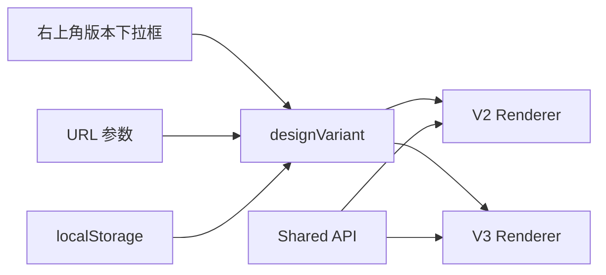

# LIVE LIFE 前端多版本设计语言

状态：当前设计基准  
最后更新：2026-06-08

## 1. 核心原则

前端未来会有多个设计版本供客户 Review。

重要原则：

```text
设计版本可以变化，但需求、页面入口、API 和购买逻辑不跟着变化。
```

固定不变：

- 品牌写作：`LIVE LIFE`
- 顶层入口：Shows / CD 严选 / Archive / Connect
- 默认语言：中文
- 支持语言：中文 / 日本語 / English
- 英文导航：全大写
- 无顶层 Shop
- CD 严选：CD / 黑胶
- 单品购买：跳外部 Shop
- Connect：票务、购买、发货、合作、投稿统一入口

## 2. Review 版本选择器

未来客户 Review 页面右上角增加版本选择器。

建议选项：

```text
V2 当前版
V3 Band Signal
V4 待定
```

行为建议：

- 支持右上角下拉框切换。
- 支持 URL 参数切换，例如 `?design=v2`、`?design=v3`。
- 支持 localStorage 记住上次选择。
- 只在本地预览或客户 Review 环境显示。
- 正式上线环境默认隐藏。

架构：



## 3. V2 当前版

状态：已实现并保留。

设计语言：

- 参考 Nintendo Systems 的网格、Schedule 面板和系统感。
- 使用米纸底、黑、亮黄、酸蓝、红色。
- 首页包含乐队名文化纹理和抽象音轨图。
- 信息组织更像音乐入口和编辑型目录。
- Schedule 面板替代 News 面板。

适合用途：

- 当前本地预览。
- 给客户展示 LIVE LIFE 的基础信息架构。
- 验证 API、三语言和页面入口。

V2 注意点：

- 已经不再使用顶层 Shop。
- 已经使用 `CD 严选`。
- 当前视觉偏“网格系统 + 音乐杂志”。

## 4. V3 Band Signal

状态：已审批通过，待实现。

核心设计：

```text
经典摇滚乐队名密集纹理
+ LIVE LIFE 字母轮播
+ 抽象音轨背景
+ 黄色 LIVE LIFE 图标和主标识
```

### 4.1 乐队名纹理

用户最新确认：

- 使用经典、耳熟能详的摇滚乐队名。
- 字号要小。
- 整体要有密密麻麻的感觉。
- 不需要 `/`、`\`、`|` 等符号区分。
- 只做连续罗列。
- 页面必须避免让用户误解为合作、授权或出演名单。

建议乐队名池：

```text
THE BEATLES THE ROLLING STONES LED ZEPPELIN PINK FLOYD QUEEN THE WHO DAVID BOWIE
THE CLASH SEX PISTOLS JOY DIVISION NEW ORDER THE SMITHS THE CURE RADIOHEAD OASIS
BLUR SUEDE PULP ARCTIC MONKEYS THE STONE ROSES MY BLOODY VALENTINE SLOWDIVE
SONIC YOUTH NIRVANA PIXIES R.E.M. TALKING HEADS RAMONES THE VELVET UNDERGROUND
```

视觉要求：

- 透明度控制在 8% 到 18%。
- 字号小，桌面约 11px 到 14px，手机约 9px 到 12px。
- 行距紧，形成纹理，不像可点击列表。
- 可以轻微移动，但速度很慢。
- 不要加分隔符，不要像名单表格。

### 4.2 LIVE LIFE 字母轮播

要求：

- 轮播内容只使用 `LIVE LIFE` 的字母。
- 可以做横向或竖向循环。
- 感觉接近磁带计数器、唱片标签或系统扫描。
- 动效要慢，不闪烁。
- 不影响正文阅读。

示意：

```text
L I V E L I F E L I V E L I F E
I V E L I F E L I V E L I F E L
V E L I F E L I V E L I F E L I
```

### 4.3 音轨背景

要求：

- 用抽象音轨替代 Nintendo 的代码/二进制。
- 不写具体歌曲名。
- 不写二进制。
- 不写程序代码。

可以使用：

- 波形。
- 采样块。
- 声道线。
- 频谱柱。
- loop 区间。
- clip marker。
- 静音片段。

### 4.4 V3 手机端第一屏

```text
┌──────────────────────────────┐
│  ◼ LIVE LIFE        V3 ▾      │
│                              │
│  THE BEATLES THE ROLLING     │
│  STONES LED ZEPPELIN PINK    │
│  FLOYD QUEEN THE WHO DAVID   │
│  BOWIE THE CLASH JOY         │
│  DIVISION NEW ORDER THE      │
│  SMITHS THE CURE RADIOHEAD   │
│  OASIS BLUR SUEDE PULP       │
│                              │
│     L I V E L I F E          │
│     I V E L I F E L          │
│                              │
│  ────╍╍━━━━╍────             │
│  ▊ ▊▊ ▊▊▊ ▊ ▊▊               │
│  ▂▃▅▇▆▃▂▁                    │
│                              │
│       ◼ LIVE LIFE            │
│  Tokyo shows, CD select,     │
│  archive and connect.        │
│                              │
│  [演出情报] [CD 严选]         │
│  [档案]   [联系]             │
├──────────────────────────────┤
│ SCHEDULE / 近期日程           │
└──────────────────────────────┘
```

手机端重点：

- 第一屏先看到 LIVE LIFE 品牌。
- 乐队名是纹理，不抢主标识。
- Schedule 面板底部露出，提示继续下滑。

### 4.5 V3 桌面端第一屏

```text
┌──────────────────────────────────────────────────────────────┐
│ ◼ LIVE LIFE                         方案: V3 Band Signal ▾   │
│                                      中文 / 日本語 / ENGLISH │
├──────────────────────────────────────────────────────────────┤
│ THE BEATLES THE ROLLING STONES LED ZEPPELIN PINK FLOYD      │
│ QUEEN THE WHO DAVID BOWIE THE CLASH JOY DIVISION NEW ORDER  │
│ THE SMITHS THE CURE RADIOHEAD OASIS BLUR SUEDE PULP         │
│ ARCTIC MONKEYS NIRVANA PIXIES R.E.M. TALKING HEADS          │
│                                                              │
│        L I V E L I F E L I V E L I F E                     │
│        I V E L I F E L I V E L I F E L                     │
│                                                              │
│  ─────── audio lane ───────╍╍╍╍──── sample ───────          │
│  ▂▃▅▇▆▃▂     ▇▇▆▅▃▁       ▄▅▆▇▆▄▂                         │
│                                                              │
│  ◼ LIVE LIFE                                                 │
│  Tokyo live shows, CD/Vinyl select, archive and connect.     │
│                                                              │
│  SHOWS        CD SELECT        ARCHIVE        CONNECT        │
├──────────────────────────────┬───────────────────────────────┤
│ SCHEDULE                     │ FEATURED SHOW                 │
└──────────────────────────────┴───────────────────────────────┘
```

## 5. 未来 V4/V5 预留

未来每一版设计都应该写清楚：

- 版本名称。
- 核心视觉语言。
- 首屏结构。
- 手机端模拟图。
- 桌面端模拟图。
- 色彩系统。
- 动效边界。
- 哪些内容复用共享 API。
- 是否适合正式上线。

建议命名方式：

```text
V2 Current Grid
V3 Band Signal
V4 Poster Archive
V5 Record Store
```

## 6. 配色方案记录

V3 优先方案：

```text
Signal Yellow / Night Graphite / Acid Blue
```

颜色：

- 黄色图标：`#FFD000`
- 夜色黑：`#101010`
- 暖白文字：`#F5F0E6`
- 酸蓝：`#2457FF`
- 品红红：`#E5002A`

备选：

- Yellow Mark / Deep Green / Warm Silver
- Yellow Mark / Charcoal / Laser Cyan

## 7. 实施建议

V3 审批已通过，建议下一步实现范围：

- 新增前端 `designVariant` 状态。
- 右上角增加版本下拉框。
- 保留 V2 不动。
- 新增 V3 首屏组件。
- V3 先实现第一屏和 Schedule 接续，不急着重做所有下方页面。
- 用同一套 API 数据渲染 V2/V3。
- 浏览器验证手机和桌面两个视口。
