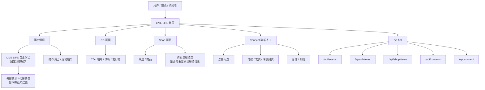
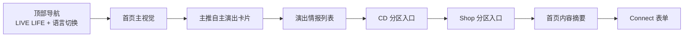

# LIVE LIFE 架构图与模拟界面审批稿

生成日期：2026-06-07

## 1. 当前需求把关

这次需求的核心变化不是简单改文案，而是把 LIVE LIFE 从“一个综合首页”改成更清楚的音乐入口：

- 首页：展示 LIVE LIFE 品牌、主推演出和入口分流。
- 演出情报页：我们自己的演出固定在最上面，推荐演出放在下面。
- CD 页面：单独放 CD、唱片、试听和发行物信息。
- Shop 页面：单独放商品。登录注册、购物车、支付和订单先不做。
- Connect：统一联系入口，承接票务、付款未收到货、发货、投稿、合作等问题。

## 2. 整体架构图



## 3. 页面信息架构



## 4. 首页模拟界面图

```text
┌────────────────────────────────────────────────────────────────────────────┐
│ LIVE LIFE                 演出情报   CD   Shop   Connect   中文 日本語 EN │
├────────────────────────────────────────────────────────────────────────────┤
│                                                                            │
│ TOKYO MUSIC ENTRY                         ┌──────────────────────────────┐ │
│ LIVE LIFE 把东京现场、CD 和 Shop 分开整理 │ API 已连接                    │ │
│                                            ├──────────────────────────────┤ │
│ 先从我们自己的演出和推荐演出情报开始，      │                              │ │
│ 把票务、CD、Shop 和售后联系拆成清楚入口。  │  紅髪少年殺人事件 海报        │ │
│                                            │                              │ │
│ [看演出情报]  [联系 LIVE LIFE]             └──────────────────────────────┘ │
│                                                                            │
├────────────────────────────────────────────────────────────────────────────┤
│ SHOWS 演出情报                                                             │
│ 我们自己的演出固定在最上面；推荐演出和历史视觉档案放在下面。               │
│                                                                            │
│ ┌──────────────────────────────────────────────────────────────────────┐   │
│ │ LIVE LIFE 自主演出                                                   │   │
│ │ 紅髪少年殺人事件 东京双日演出                                        │   │
│ │ 7/10 GRIT at Shibuya / 7/14 Shimokitazawa THREE                     │   │
│ │ 票务待确认：外部票站，不在 LIVE LIFE 站内直接结算                    │   │
│ └──────────────────────────────────────────────────────────────────────┘   │
│                                                                            │
│ ┌────────────────────────────┐  ┌──────────────────────────────────────┐   │
│ │ 推荐 / 档案                 │  │ CD 单独成页                          │   │
│ │ Wednesday Wonderland 视觉   │  │ 试听、发行物介绍、购买入口待接入      │   │
│ └────────────────────────────┘  └──────────────────────────────────────┘   │
│                                                                            │
├────────────────────────────────────────────────────────────────────────────┤
│ SHOP                                                                       │
│ Shop 独立展示；登录注册、购物车、支付、订单等购买流程先待讨论。             │
│                                                                            │
├────────────────────────────────────────────────────────────────────────────┤
│ CONNECT                                                                    │
│ 付款、票务、发货或合作问题，都从这里联系。                                 │
│ [昵称] [邮箱] [问题类型] [留言] [发送消息]                                  │
└────────────────────────────────────────────────────────────────────────────┘
```

## 5. 视觉方向

建议方向：

- 背景不使用纯白，改成深黑灰舞台底色。
- 字体使用系统 UI 字体栈，优先接近 Apple 页面那种干净、清晰、字重有层次的感觉。
- 主色从海报里提取：黑灰底、奶白文字、洋红强调、暖黄色强调、少量绿色状态色。
- 页面布局保持留白和模块分区，但不要做营销感过重的落地页。
- 活动图片做真实素材展示，不用假插画。

## 6. 内容来源备注

目前活动本身没有找到稳定可引用的公开官方活动页，所以演出日期、票价和 lineup 先按你提供的海报与文本录入。

公开资料可作为辅助说明：

- 紅髪少年殺人事件：公开音乐博客介绍其为广州出身的另类摇滚乐队，并提到 2025 年发行首张专辑《BRUTAL GIRL DELUSION》。来源：https://killer-yoshikage.hatenablog.com/entry/2026/03/22/204929
- ルサンチマン：Eggs 艺术家页标注其地区为东京都，类型为 Alternative / Rock。来源：https://eggs.mu/artist/rusantiman_band/
- おそロシア革命：TuneCore 页面介绍其来自广岛县尾道市，当前以吉他主唱デスメイド大西的 solo 名义活动，并强调作品制作的 DIY 属性。来源：https://linkco.re/4dn89Ucs?lang=ja
- GRIT at Shibuya：官方 about 页面给出地址为东京都涩谷区道玄坂 2-23-12 フォンティスビル B1。来源：https://grit-live.jp/contents/about
- Shimokitazawa THREE：官方 access 页面给出地址为东京都世田谷区代泽 5-18-1 カラバッシュビル B1F，并说明 BASEMENT BAR 与 THREE 在同一楼层。来源：https://www.toos.co.jp/3/access/
- 小红书和 Instagram：第一轮公开搜索没有找到可稳定引用的公开结果；后续如果你有官方账号链接或帖子链接，可以直接补到内容库。

## 7. 需要你审批的点

1. 是否同意导航拆成：演出情报 / CD / Shop / Connect。
2. 是否同意 LIVE LIFE 自主演出固定在演出情报页最上方。
3. 是否同意演出票务先跳外部票站，不进站内支付。
4. 是否同意 Shop 暂不做登录注册，等购买流程确定后再做。
5. 是否同意当前深色视觉方向：黑灰底、奶白文字、洋红和暖黄色强调。
6. 首页主视觉图是否暂时使用「紅髪少年殺人事件」海报，等你后续上传正式首页图后替换。
