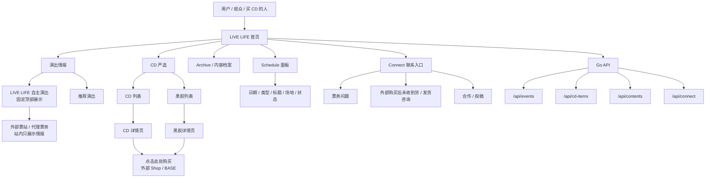
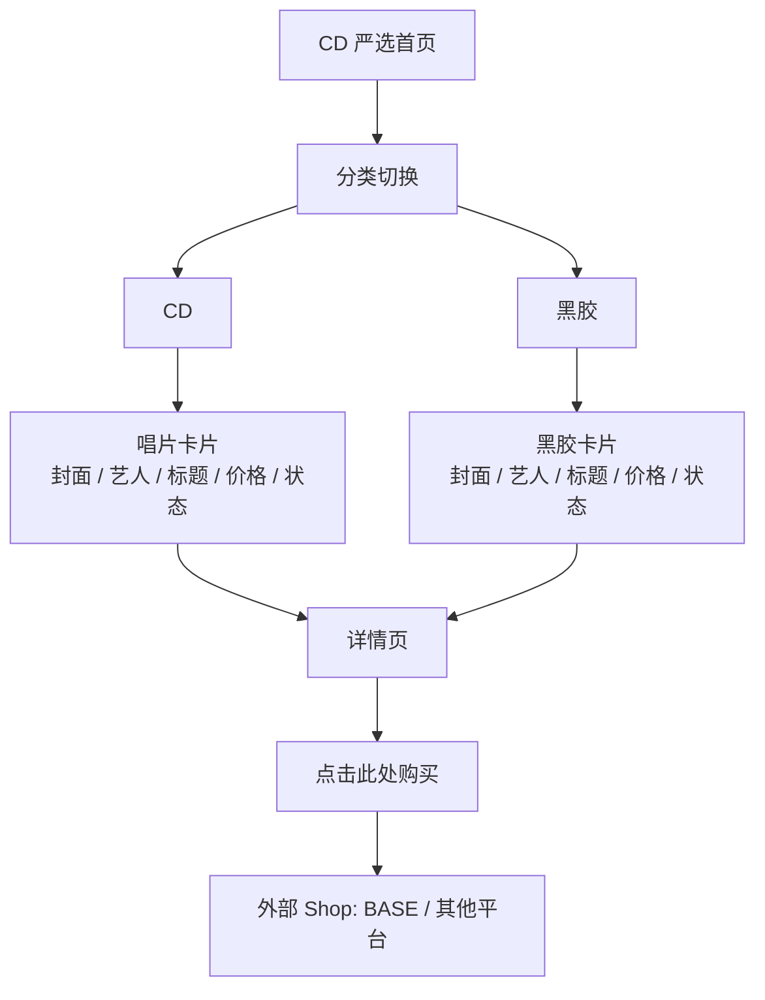

# LIVE LIFE 架构图与 UI 设计审批稿 V2

生成日期：2026-06-07

状态：已按 2026-06-07 用户回复审批通过，并已进入实现。本文档是当前 V2 UI 和信息架构的依据。

## 1. 本轮需求变更摘要

这次不是小修 UI，而是把 LIVE LIFE 的首页气质和商品结构重新定方向：

- 首页视觉参考 Nintendo Systems 的“系统感、网格感、强品牌色、信息面板”，但不照搬其代码/二进制主题。
- 背景纹理从“代码文本”改成“经典英摇/另类摇滚乐队与艺人名罗列”，突出音乐历史感。
- 数据流从“二进制”改成“音乐制作相关的数据流”，例如采样音轨、波形轨道、BPM、Take 编号、Track Lane、Loop、Cue、Mix Bus 等。
- 顶部入口不再有单独 Shop 页面。
- `CD` 入口改名为 `CD 严选`。
- `CD 严选` 内部分成 `CD` 和 `黑胶` 两类。
- 单张 CD/黑胶详情页里再放购买按钮，按钮文案为 `点击此处购买`，链接到外部 Shop，例如 BASE。
- 未来 LIVE LIFE 左侧会加黄色厂牌图标，所以整体色系要围绕“黄色 logo 前提”寻找冲突色，而不是把页面做成黄色。
- News 面板改成类似 Schedule 的结构，优先展示日期、场地、项目状态和行动入口。

## 2. 新整体架构图



## 3. 页面导航建议

顶部导航已确认：

```text
中文界面：LIVE LIFE [黄色图标]     演出情报     CD 严选     档案     联系
日语界面：LIVE LIFE [黄色图标]     ライブ情報     CDセレクト     アーカイブ     問い合わせ
英语界面：LIVE LIFE [黄色图标]     SHOWS     CD SELECT     ARCHIVE     CONNECT
```

说明：

- 不放 `Shop` 顶部入口。
- `CD 严选` 是商业入口，但表达上更像厂牌/店主精选，不像普通电商。
- `Archive` 用来收历史海报、照片、文章和推荐内容。
- `Connect` 继续作为售后、票务、投稿、合作联系入口。

## 4. 首页视觉结构

参考 Nintendo Systems 的结构语言，但替换成 LIVE LIFE 的音乐语言。

```text
┌────────────────────────────────────────────────────────────────────────────┐
│ LIVE LIFE [黄色图标]       Shows / CD 严选 / Archive / Connect / 语言切换 │
├────────────────────────────────────────────────────────────────────────────┤
│                                                                            │
│  THE SMITHS / OASIS / BLUR / RADIOHEAD / PULP / SUEDE / JOY DIVISION       │
│  MY BLOODY VALENTINE / SLOWDIVE / THE CURE / NEW ORDER / PRIMAL SCREAM     │
│                                                                            │
│                              ┌───────────────────────┐                     │
│  TRACK 01  BPM 128           │       LIVE LIFE       │      WAVEFORM  //// │
│  TAKE A03  LOOP 16           │  TOKYO MUSIC ENTRY    │      SAMPLE 07 //// │
│                              └───────────────────────┘                     │
│                                                                            │
├──────────────────────────────────────────────────────────────┬─────────────┤
│ Shows                                                        │ Schedule    │
│ CD 严选                                                      │ 07.10 LIVE  │
│ Archive                                                      │ 07.14 LIVE  │
│ Connect                                                      │ CD UPDATE   │
│                                                              │ NEW STOCK   │
├──────────────────────────────────────────────────────────────┴─────────────┤
│ Shows: LIVE LIFE 自主演出固定顶部，推荐演出下置                              │
│ CD 严选: CD / 黑胶，详情页内放外部购买按钮                                    │
│ Connect: 票务、购买后未收到货、合作、投稿                                     │
└────────────────────────────────────────────────────────────────────────────┘
```

## 5. 背景纹理设计

不要代码文本，不要二进制。

建议分成两层：

1. 乐队名 / 艺人名历史层

   优先英摇、另类摇滚、独立音乐史语境。可以使用类似：

   ```text
   THE SMITHS / OASIS / BLUR / RADIOHEAD / PULP / SUEDE /
   JOY DIVISION / NEW ORDER / THE CURE / STONE ROSES /
   MY BLOODY VALENTINE / SLOWDIVE / PRIMAL SCREAM /
   MASSIVE ATTACK / PORTISHEAD / SONIC YOUTH / PIXIES
   ```

   注意：这些名字只作为视觉纹理和文化坐标，不能暗示官方合作或授权。

2. 音乐制作数据流层

   用类似制作软件/录音工程的文字数据，不用程序代码：

   ```text
   TRACK 01 / TAKE A03 / BPM 128 / LOOP 16 / CUE 04 /
   STEM DRUM / STEM BASS / BUS A / MIX REV 02 /
   SAMPLE 07 / NOISE FLOOR -48DB / TAPE HISS / WAVEFORM
   ```

   视觉上可以模拟轨道线、波形、采样片段、时间码，不要做成科技公司代码墙。

## 6. CD 严选结构

`CD 严选` 页面建议：



详情页包含：

- 封面图
- 艺人名
- 标题
- 格式：CD / 黑胶
- 简短推荐语
- 曲目或说明
- 库存/状态
- `点击此处购买` 按钮
- 外部平台说明：购买会跳转到 BASE 等外部页面

## 7. Schedule 面板设计

News 面板不做传统新闻列表，改成类似 Schedule。

```text
SCHEDULE
────────────────────────
07.10  LIVE   GRIT at Shibuya
       紅髪少年殺人事件
       ticket pending

07.14  LIVE   Shimokitazawa THREE
       ルサンチマン / おそロシア革命
       ticket pending

TBD    CD     New selected titles
       CD 严选更新准备中

TBD    VINYL  Selected vinyl
       黑胶分区准备中
```

设计重点：

- 信息密度高，但层级清楚。
- 日期是第一视觉锚点。
- 类型标签使用 `LIVE / CD / VINYL / ARCHIVE`。
- 状态使用小字：`ticket pending`、`new stock`、`sold out`、`external shop`。
- 面板可以放在首页右侧或入口矩阵旁边。

## 8. 色系建议

前提：未来 LIVE LIFE 左侧图标大概率是黄色。

黄色图标建议作为高识别点，不让整个页面变黄。可以选择一组冲突色来托住黄色：

### 方案 A：黄色图标 + 深海军蓝 + 纸白 + 红橙

- Logo 黄：`#FFD43B`
- 背景深蓝黑：`#101522`
- 内容纸白：`#F4F0E8`
- 强调红橙：`#FF4B2B`
- 辅助灰蓝：`#8D99AE`

优点：音乐夜场感保留，黄色图标很亮，红橙有演出海报冲突感。

### 方案 B：黄色图标 + 象牙白 + 黑字 + 酸性蓝

- Logo 黄：`#FFD000`
- 背景象牙白：`#F6F0DF`
- 主文字黑：`#111111`
- 冲突蓝：`#2457FF`
- 辅助红：`#E5002A`

优点：更接近 Nintendo Systems 的干净网格，但 LIVE LIFE 仍有音乐杂志感。

### 方案 C：黄色图标 + 暗紫黑 + 冷青 + 奶白

- Logo 黄：`#F6C945`
- 背景暗紫黑：`#151019`
- 冲突冷青：`#00C2BA`
- 文字奶白：`#F4EFE7`
- 辅助洋红：`#E13D8F`

优点：更另类、更夜场、更适合英摇/独立音乐气质。

我的建议：先做 **方案 B 或 A** 的 UI 稿。B 更像参考站，A 更适合 LIVE LIFE 的音乐现场。

## 9. 下一版首页模块顺序

建议顺序：

1. Opening / Hero
   - 乐队名纹理
   - 音乐制作数据流
   - 中央 LIVE LIFE 品牌块

2. Entry Grid
   - Shows
   - CD 严选
   - Archive
   - Connect

3. Schedule Panel
   - 近期演出
   - CD/黑胶更新
   - 状态标签

4. Featured Shows
   - LIVE LIFE 自主演出置顶
   - 推荐演出

5. CD 严选 Preview
   - CD / 黑胶两类
   - 点击进入详情，再外链购买

6. Connect
   - 售后、票务、合作、投稿入口

## 10. 需要审批的点

1. 顶部导航：已确认。英文界面使用 `SHOWS / CD SELECT / ARCHIVE / CONNECT` 全大写；中文和日语界面翻译。
2. 顶层 Shop：已确认不设置。
3. CD 严选分类：已确认分为 `CD / 黑胶`。
4. 购买路径：已确认单品详情页按钮 `点击此处购买` 跳外部 BASE 等 Shop。
5. 首页纹理：已确认使用真实经典英摇/另类摇滚乐队名罗列；音乐制作数据流改为抽象音轨/波形/采样轨道，不写过于具体的 Track 名称。
6. Schedule 面板：已确认替代 News 面板。
7. 色系：当前实现先用“黄色图标 + 象牙纸底 + 黑字 + 酸性蓝 + 红”。
8. 真实乐队名：已确认可以作为文化参考文本，但页面避免“合作/授权”误读。

## 11. 其他可选配色方案

当前实现采用方案 B 的变体。后续如果你觉得不够 LIVE LIFE，可以继续试这些：

### 方案 D：黄色图标 + 银灰底 + 深红 + 黑

- Logo 黄：`#FFD000`
- 背景银灰：`#E9E6DC`
- 主文字黑：`#101010`
- 强调深红：`#B00020`
- 辅助铁灰：`#4D5358`

感觉：更像音乐杂志和唱片资料馆。

### 方案 E：黄色图标 + 墨绿黑 + 象牙白 + 红

- Logo 黄：`#F7D13D`
- 背景墨绿黑：`#101C17`
- 文字象牙白：`#F4EFDF`
- 强调红：`#E62E2E`
- 辅助灰绿：`#8FA99B`

感觉：更夜场、更独立厂牌。

### 方案 F：黄色图标 + 低饱和蓝灰 + 荧光粉

- Logo 黄：`#FFD000`
- 背景蓝灰：`#D9DEE7`
- 主文字黑：`#111111`
- 冲突粉：`#FF2F92`
- 辅助钴蓝：`#2457FF`

感觉：更年轻、更接近独立音乐海报和社交媒体视觉。
