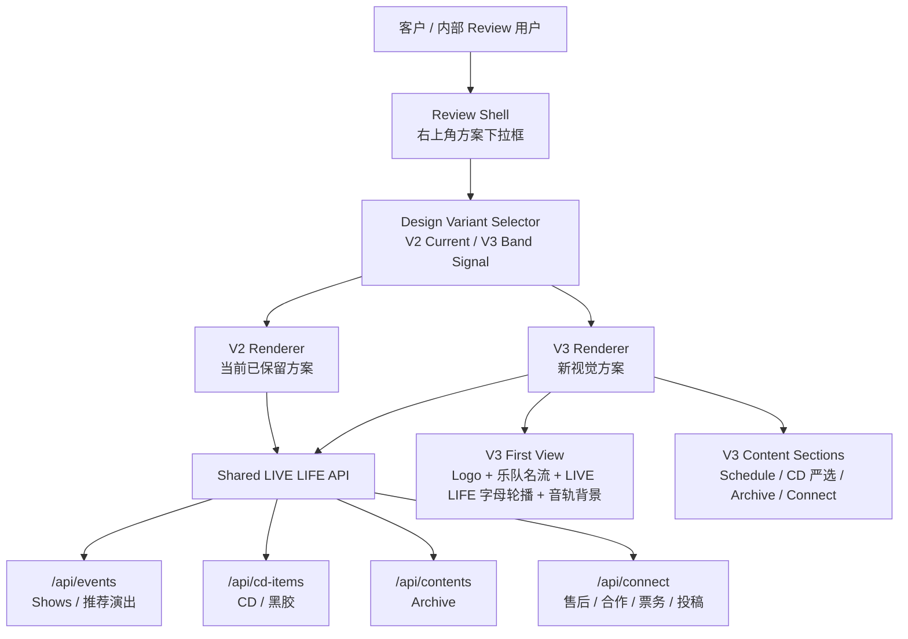
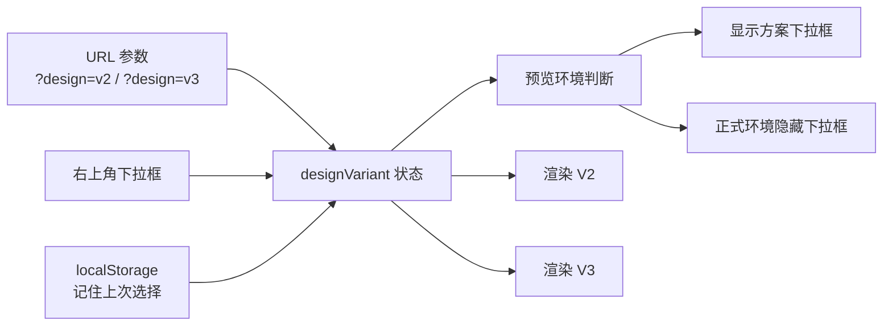
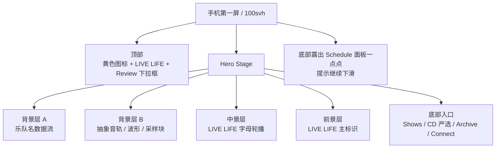

# LIVE LIFE V3 设计方案审批稿

状态：已审批通过  
日期：2026-06-08  
范围：只提出 V3 架构图与模拟页面设计，不替换当前 V2 代码。V2 继续保留为稳定版本。

## 1. V3 设计目标

V3 的方向是把当前 V2 的信息结构保留下来，但重新设计首页第一屏的视觉语言：

- 参考 Nintendo Systems 移动端第一屏的“品牌标识 + 数据背景 + 进入内容”的节奏。
- `Nintendo Systems` 替换为 `LIVE LIFE` 与未来黄色图标。
- 原本类似二进制/代码的数据背景，改成真实经典摇滚乐队名组成的密集纹理。
- `LIVE LIFE` 字母做轮播或切片动画，让品牌名像唱片机、磁带或跑马灯一样循环出现。
- 原本代码感的整体背景，改成抽象音轨、波形、采样块、声道线和频谱网格。
- 功能结构仍然清楚：Shows / CD 严选 / Archive / Connect，不回到顶层 Shop。

## 2. 参考来源与提炼

### Nintendo Systems 参考点

可借鉴：

- 第一屏品牌识别非常明确，Logo 与背景图形先建立记忆点。
- 首页后续内容是清楚的信息分区，例如 News、Company、Services、Engineering、Culture 等。
- Engineering 区块有重复文字与信息流，适合转译成 LIVE LIFE 的乐队名流和音轨信息流。

不直接照搬：

- 不使用 Nintendo 的二进制内容。
- 不使用 Nintendo 的品牌红或它的图标语言。
- 不做“科技公司官网”语气，而是做“音乐/现场/厂牌/生活方式入口”。

### 音乐网站参考点

可借鉴：

- 音乐项目网站必须保持演出、音乐、周边/购买、联系入口清楚。
- 第一屏可以非常视觉化，但下方必须很快接上可行动内容：演出日程、CD/黑胶严选、Archive 和 Connect。
- 对 LIVE LIFE 来说，视觉必须能表达历史感、文化索引感和东京现场情报感。

## 3. 总体信息架构



说明：

- V2 和 V3 不拆两套后端，避免以后维护混乱。
- 只拆前端视觉层：同一份 API 数据，两个视觉 Renderer。
- Review 下拉框建议只在本地预览或客户审批环境显示，正式上线后隐藏。
- 切换方式建议支持两种：右上角下拉框 + URL 参数，例如 `?design=v3`。

## 4. Review 模式架构



下拉框建议文案：

- `V2 当前版`
- `V3 Band Signal`

位置：

- 桌面端：右上角，放在语言切换左侧或下方。
- 手机端：右上角浮层，尺寸小一点，避免压住 LIVE LIFE 标志。

## 5. V3 第一屏视觉结构



层级说明：

- `背景层 A`：真实经典摇滚乐队名，像密集小字纹理一样轻微滚动。优先耳熟能详的名字，例如 THE BEATLES、THE ROLLING STONES、LED ZEPPELIN、PINK FLOYD、QUEEN、THE WHO、DAVID BOWIE、THE CLASH、JOY DIVISION、NEW ORDER、THE SMITHS、THE CURE、RADIOHEAD、OASIS、BLUR、SUEDE、PULP、ARCTIC MONKEYS、NIRVANA、PIXIES 等。
- `背景层 B`：抽象音乐制作视觉，不写具体歌曲名。使用轨道线、波形点阵、采样块、静音区、loop 区间、频谱柱。
- `中景层`：`LIVE LIFE` 字母轮播，比如 L / I / V / E / L / I / F / E 在竖向轨道里循环。
- `前景层`：品牌主标识，未来黄色图标在左，右边是 `LIVE LIFE`。
- `底部入口`：保持操作清楚，不让视觉压过功能。

## 6. 手机端模拟页面

```text
┌──────────────────────────────┐
│  ◼ LIVE LIFE        V3 ▾      │
│                              │
│  THE BEATLES THE ROLLING     │
│  STONES LED ZEPPELIN PINK    │
│  FLOYD QUEEN THE WHO DAVID   │
│  BOWIE THE CLASH JOY         │
│  DIVISION NEW ORDER THE      │
│  SMITHS THE CURE RADIOHEAD   │
│  OASIS BLUR SUEDE PULP       │
│                              │
│     L  I  V  E              │
│     I  F  E  L              │
│                              │
│  ────╍╍╍━━━━╍╍──────        │
│  ▊ ▊▊  ▊▊▊   ▊ ▊▊           │
│  ━━━━ sample block ━━━       │
│                              │
│       ◼ LIVE LIFE            │
│  Tokyo shows, CD select,     │
│  archive and connect.        │
│                              │
│  [演出情报] [CD 严选]         │
│  [档案]   [联系]             │
├──────────────────────────────┤
│ SCHEDULE / 近期日程           │
│ 2026.07.10 紅髪少年殺人事件  │
└──────────────────────────────┘
```

手机端重点：

- 第一屏必须先看到品牌，不先看到普通导航。
- 乐队名背景字号要小、数量要密，不使用 `/`、`\`、`|` 等符号分隔，只做连续罗列。
- 乐队名背景不要太亮，避免像“合作名单”。
- `LIVE LIFE` 字母轮播可以慢速移动，不能闪烁。
- Schedule 面板底部露出一点，让用户知道页面可以继续下滑。

## 7. 桌面端模拟页面

```text
┌──────────────────────────────────────────────────────────────┐
│ ◼ LIVE LIFE                         方案: V3 Band Signal ▾   │
│                                      中文 / 日本語 / ENGLISH │
├──────────────────────────────────────────────────────────────┤
│                                                              │
│  THE BEATLES THE ROLLING STONES LED ZEPPELIN PINK FLOYD      │
│  QUEEN THE WHO DAVID BOWIE THE CLASH JOY DIVISION NEW ORDER  │
│  THE SMITHS THE CURE RADIOHEAD OASIS BLUR SUEDE PULP         │
│  ARCTIC MONKEYS NIRVANA PIXIES R.E.M. TALKING HEADS          │
│                                                              │
│        L I V E    L I F E    L I V E    L I F E             │
│                                                              │
│  ──────── audio lane ────────╍╍╍╍╍──── sample ────────       │
│  ▂▃▅▇▆▃▂     ▇▇▆▅▃▁        ▄▅▆▇▆▄▂                       │
│                                                              │
│  ◼ LIVE LIFE                                                 │
│  Tokyo live shows, CD/Vinyl select, archive and contact.     │
│                                                              │
│  SHOWS        CD SELECT        ARCHIVE        CONNECT        │
├──────────────────────────────┬───────────────────────────────┤
│ SCHEDULE                     │ FEATURED SHOW                 │
│ 07.10 / Shibuya              │ 紅髪少年殺人事件               │
│ 07.14 / Shimokitazawa        │ ticket info / lineup          │
└──────────────────────────────┴───────────────────────────────┘
```

桌面端重点：

- 第一屏可以更宽，更强调音轨横向流动。
- 顶部右侧放 Review 方案选择器和语言切换。
- 入口不做传统大导航条，而是作为第一屏底部的四个高对比入口。
- 第一屏下半部分立刻接 Schedule / Featured Show，让用户从视觉进入具体内容。

## 8. 动效建议

### 乐队名数据流

- 速度：非常慢，像系统背景，不像广告跑马灯。
- 方向：桌面横向，手机可轻微纵向。
- 透明度：10% 到 22%。
- 交互：滚动时轻微错位，制造层次。
- 字号：小字号密集排布，桌面约 11px 到 14px，手机约 9px 到 12px。
- 分隔：不使用符号分隔，只连续罗列。

### LIVE LIFE 字母轮播

- 每个字母在固定轨道内循环，不做花哨 3D。
- 可做“磁带计数器”或“唱片标签转动”的感觉。
- 手机端只显示 2 到 3 列，避免拥挤。

### 音轨背景

- 用 CSS 或 Canvas 画抽象轨道。
- 元素包括：波形、采样块、声道线、clip marker、loop 区间。
- 不写歌曲名，不写代码，不写二进制。

## 9. 配色方案

### 方案 A：Signal Yellow / Night Graphite / Acid Blue

推荐优先级：最高

- 黄色图标：`#FFD000`
- 夜色黑：`#101010`
- 暖白文字：`#F5F0E6`
- 酸蓝：`#2457FF`
- 品红红：`#E5002A`

感觉：强、年轻、偏音乐现场，也能承接未来黄色图标。

### 方案 B：Yellow Mark / Deep Green / Warm Silver

- 黄色图标：`#FFD000`
- 深绿黑：`#0B1712`
- 银灰：`#D8D4C8`
- 冲突色橙红：`#FF4B1F`
- 辅助蓝灰：`#607D8B`

感觉：更成熟、更像厂牌档案馆，历史感更强。

### 方案 C：Yellow Mark / Charcoal / Laser Cyan

- 黄色图标：`#FFD000`
- 炭黑：`#151515`
- 激光青：`#00D8FF`
- 暖灰：`#E7E1D3`
- 暗红：`#B11226`

感觉：更科技、更像“音乐系统”，适合强调数据流和音轨。

## 10. 审批问题

请确认：

1. V3 是否按 `Band Signal` 方向继续：经典摇滚乐队名密集纹理 + LIVE LIFE 字母轮播 + 抽象音轨背景。已通过。
2. 是否同意未来加 Review 下拉框，在右上角切换 `V2 当前版 / V3 Band Signal`。已通过。
3. V3 是否先以手机端第一屏为核心，再适配桌面。已通过。
4. 配色是否先按方案 A 做高保真页面。已通过。
5. 乐队名是否继续使用真实乐队/艺人名，并在页面避免“合作/授权/出演”误读。已通过。

## 11. 审批后实施范围

如果 V3 审批通过，建议下一步只做本地预览实现：

- 新增 `designVariant` 状态。
- 右上角加 Review 下拉框。
- V2 保持现状。
- 新增 V3 首页第一屏组件。
- 复用现有 `/api/events`、`/api/cd-items`、`/api/contents`、`/api/connect`。
- 浏览器验证手机和桌面两个视口。
